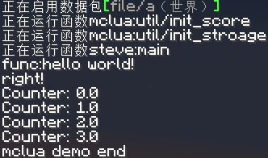

# mclua - Lua Compiler for Minecraft Datapacks

Up to now, the compiler does not have full Lua language support, and there is a variable scope problem, which cannot be used for large-scale projects.

If you can help with the development, please submit a Pull Request.

## features

- [x] Variable defines (basic types)
- [x] Function defines (need define types for arguments)
- [x] Function calls
- [x] print/command functions (use `command("")` to execute Minecraft commands)
- [x] String combines (two strings one time)
- [x] For in/While/Repeat
- [x] If/Else
- [ ] advanced math functions
- [ ] better performance
- [ ] variable local range
      ...

## installation

on Linux/Mac OS:

```sh
python3 -m venv .venv
source .venv/bin/activate
pip install -r requirements.txt
```

on Windows (PowerShell):

```powershell
Set-ExecutionPolicy -ExecutionPolicy RemoteSigned -Scope CurrentUser
python -m venv .venv
.venv\bin\activate.ps1
pip install -r requirements.txt
```

you need to delete `print(val)` to remove the debug output.
( at `.venv/lib/python3.*/site-packages/luaparser/ast.py` line 37)

## usage

Build with:

```sh
# Compile *.lua to a datapack
# This toll won't zip the datapack, it only output a directory
python datapack.py "input file" "output dir" "pack id"

# Compile *.lua to some mcfunction files
python compile.py "input file" "output dir" "pack id" # pack id is optional
```

Run in minecraft:

```mcfunction
/function mclua:util/init_stroage
/function mclua:util/init_score

/function output:main # replace "output" with your pack id

/function mclua:util/remove_stroage
```

## examples



```lua
a = "hello world!"
function hello( arg1__string )
    aa = "func:" + arg1
    print(aa)
    return aa
end
hello(a)
c = 123 % 5
if c == 3 then
    print("right!")
else
    print("wrong!")
end
for i=0,3,1 do
    j = str(i)
    j = "Counter: " + j
    print(j)
end
print("mclua demo end")
```

### License: [GPL-3.0](LICENSE)
